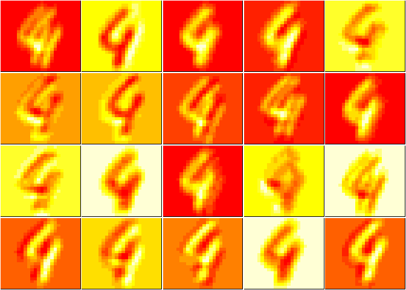
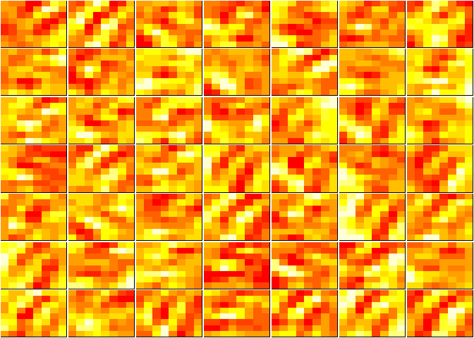
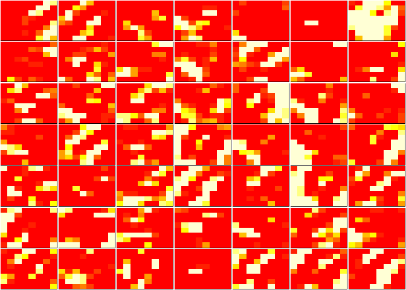
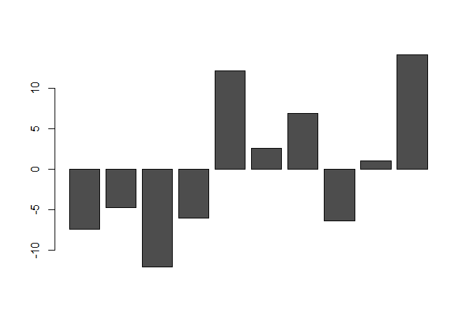
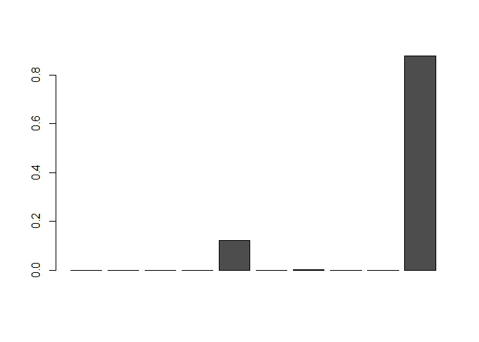

In this [R Notebook](http://rmarkdown.rstudio.com/r_notebooks.html) I implement an [Convolutional Neural Network (CNN)](https://en.wikipedia.org/wiki/Convolutional_neural_network) using the [MNIST Database](http://yann.lecun.com/exdb/mnist/) for handwritten digits recognition using [mxnet](http://mxnet.io/) framework for [R](https://www.r-project.org/).

<!--more-->

### Setup

You will need to install the [mxnet for R](http://mxnet.io/get_started/windows_setup.html) and, if you intent to use your GPU card, the [NVidia CUDA Drivers](http://www.nvidia.com/object/cuda_home_new.html).

Download all four dataset files from [MNIST site](http://yann.lecun.com/exdb/mnist/) and gunzip them in the project directory.

Finally, load the libraries.


```r
library(mxnet)    # ann framework
library(magrittr) # to use modeling the framework
library(caret)    # to use to check the performace
```


### Loading dataset

We'll use an adaptation of [gist from Brendan o'Connor](http://gist.github.com/39760) to read the files transforming them in a structure simple to use and access.


```r
# read function returns a list of datasets
load_mnist <- function() {
  load_image_file <- function(filename) {
    ret = list()
    f = file(filename,'rb')
    readBin(f,'integer',n=1,size=4,endian='big')
    ret$n = readBin(f,'integer',n=1,size=4,endian='big')
    nrow = readBin(f,'integer',n=1,size=4,endian='big')
    ncol = readBin(f,'integer',n=1,size=4,endian='big')
    x = readBin(f,'integer',n=ret$n*nrow*ncol,size=1,signed=F)
    ret$x = matrix(x, ncol=nrow*ncol, byrow=T)
    close(f)
    ret
  }
  load_label_file <- function(filename) {
    f = file(filename,'rb')
    readBin(f,'integer',n=1,size=4,endian='big')
    n = readBin(f,'integer',n=1,size=4,endian='big')
    y = readBin(f,'integer',n=n,size=1,signed=F)
    close(f)
    y
  }
  train <- load_image_file('./data/train-images.idx3-ubyte')
  test <- load_image_file('./data/t10k-images.idx3-ubyte')
  
  train$y <- load_label_file('./data/train-labels.idx1-ubyte')
  test$y <- load_label_file('./data/t10k-labels.idx1-ubyte')  
  
  return(
    list(
      train = train,
      test = test
    )
  )
}

# plot one case
show_digit <- function(arr784, col=gray(12:1/12), ...) {
  image(matrix(arr784, nrow=28)[,28:1], col=col, ...)
}

# load
mnist <- load_mnist()
```


Let's check the dataset loaded.


```r
labels <- paste(mnist$train$y[1:5],collapse = ", ")
par(mfrow=c(1,5), mar=c(0.1,0.1,0.1,0.1))
for(i in 1:5) show_digit(mnist$train$x[i,])
```


Labels: 5, 0, 4, 1, 9


### Convolutional Neural Network

#### LeNet

In this exercise I'll use one of the LeNet archictecutre for the neural network, based in two sets of Convolutional filters and poolings and two fully connected layers, as show bellow.


#### Magrittr

I used the [R magrittr pipe operator]() to build the network in the mxnet, is easer to read the code. But, we'll check the output of each individual layer and to keep the link with intermediary symbols I declare an assign operator to work in the pipe.


```r
# pipe assign function
# example:  rnorm(5,mean=5) %>% sqrt() %=>% "varname" %>% mean()

"%=>%" <- function(val,var) {
  assign(substitute(var),val, envir = .GlobalEnv)
  return(val)
}
```


#### Neural Network

Finnally, lets model the Neural Network.


```r
# input data
lenet <- mx.symbol.Variable("data") %>%
  
  # Convolutional Layer Set 1 ( Conv > Tanh > Pool )
  mx.symbol.Convolution( kernel=c(5,5), num_filter=20, name="Conv1" )  %=>% "Conv1" %>%
  mx.symbol.Activation( act_type="tanh", name="Act1" )                 %=>% "Act1" %>%
  mx.symbol.Pooling( pool_type="max", kernel=c(2,2), 
                     stride=c(2,2), name = "Pool1")                    %=>% "Pool1" %>%
  
  # Convolutional Layer Set 1 ( Conv > Tanh > Pool )
  mx.symbol.Convolution( kernel=c(5,5), num_filter=50 , name="Conv2")  %=>% "Conv2" %>%
  mx.symbol.Activation( act_type="tanh", name="Act2" )                 %=>% "Act2" %>%
  mx.symbol.Pooling( pool_type="max", kernel=c(2,2),
                     stride=c(2,2), name = "Pool2")                    %=>% "Pool2" %>%
  
  # Flat representation 50 2D filters -> 1D Array
  mx.symbol.flatten( name="Flat")                                      %=>% "Flat1" %>%
  
  # Fully Connected Layer 1
  mx.symbol.FullyConnected( num_hidden=500, name="Full1" )             %=>% "Full1" %>%
  mx.symbol.Activation( act_type="tanh", name="Act3" )                 %=>% "Act3" %>%
  
  # Fully Connected Layer 1
  mx.symbol.FullyConnected( num_hidden=10 , name="Full2")              %=>% "Full2" %>%
  mx.symbol.SoftmaxOutput(name="SoftM")                                %=>% "SoftM" 
```

Checking the model built


```r
graph.viz( lenet, direction = "LR" )
```

<!--html_preserve-->
<div id="htmlwidget-9a244dfcea0445744132" style="width:960px;height:96px;" class="grViz html-widget html-widget-static-bound"><!--?xml version="1.0" encoding="UTF-8" standalone="no"?-->

<!-- Generated by graphviz version 2.40.1 (20161225.0304)
 -->
<!-- Title: %0 Pages: 1 -->
<svg viewBox="0.00 0.00 1528.34 90.59" xmlns="http://www.w3.org/2000/svg" xmlns:xlink="http://www.w3.org/1999/xlink" style="width: 100%; height: 100%;">
<g id="graph0" class="graph" transform="scale(1 1) rotate(0) translate(4 86.5901)">
<title>%0</title>
<polygon fill="#ffffff" stroke="transparent" points="-4,4 -4,-86.5901 1524.337,-86.5901 1524.337,4 -4,4"></polygon>
<!-- 1 -->
<g id="node1" class="node">
<title>1</title>
<ellipse fill="#8dd3c7" stroke="#8dd3c7" stroke-width="2" cx="27.8033" cy="-41.295" rx="27.608" ry="29.3315"></ellipse>
<text text-anchor="middle" x="27.8033" y="-45.495" font-family="Times,serif" font-size="14.00" fill="#ffffff">data</text>
<text text-anchor="middle" x="27.8033" y="-28.695" font-family="Times,serif" font-size="14.00" fill="#ffffff">data</text>
</g>
<!-- 2 -->
<g id="node2" class="node">
<title>2</title>
<polygon fill="#fb8072" stroke="#fb8072" stroke-width="2" points="177.6192,-70.6964 91.6024,-70.6964 91.6024,-11.8937 177.6192,-11.8937 177.6192,-70.6964"></polygon>
<text text-anchor="middle" x="134.6108" y="-53.895" font-family="Times,serif" font-size="14.00" fill="#ffffff">Convolution</text>
<text text-anchor="middle" x="134.6108" y="-37.095" font-family="Times,serif" font-size="14.00" fill="#ffffff">Conv1</text>
<text text-anchor="middle" x="134.6108" y="-20.295" font-family="Times,serif" font-size="14.00" fill="#ffffff">5X5 / , 20</text>
</g>
<!-- 1&#45;&gt;2 -->
<g id="1" class="edge">
<title>1-&gt;2</title>
<path fill="none" stroke="#000000" d="M55.8657,-41.295C63.6843,-41.295 72.4463,-41.295 81.2083,-41.295"></path>
<polygon fill="#000000" stroke="#000000" points="81.4375,-44.7951 91.4375,-41.295 81.4375,-37.7951 81.4375,-44.7951"></polygon>
</g>
<!-- 3 -->
<g id="node3" class="node">
<title>3</title>
<polygon fill="#ffffb3" stroke="#ffffb3" stroke-width="2" points="288.7624,-70.6964 213.5658,-70.6964 213.5658,-11.8937 288.7624,-11.8937 288.7624,-70.6964"></polygon>
<text text-anchor="middle" x="251.1641" y="-53.895" font-family="Times,serif" font-size="14.00" fill="#ffffff">Activation</text>
<text text-anchor="middle" x="251.1641" y="-37.095" font-family="Times,serif" font-size="14.00" fill="#ffffff">Act1</text>
<text text-anchor="middle" x="251.1641" y="-20.295" font-family="Times,serif" font-size="14.00" fill="#ffffff">tanh</text>
</g>
<!-- 2&#45;&gt;3 -->
<g id="2" class="edge">
<title>2-&gt;3</title>
<path fill="none" stroke="#000000" d="M177.6798,-41.295C185.9782,-41.295 194.7189,-41.295 203.1625,-41.295"></path>
<polygon fill="#000000" stroke="#000000" points="203.2647,-44.7951 213.2647,-41.295 203.2647,-37.7951 203.2647,-44.7951"></polygon>
</g>
<!-- 4 -->
<g id="node4" class="node">
<title>4</title>
<ellipse fill="#80b1d3" stroke="#80b1d3" stroke-width="2" cx="394.8646" cy="-41.295" rx="70.303" ry="41.0911"></ellipse>
<text text-anchor="middle" x="394.8646" y="-53.895" font-family="Times,serif" font-size="14.00" fill="#ffffff">Pooling</text>
<text text-anchor="middle" x="394.8646" y="-37.095" font-family="Times,serif" font-size="14.00" fill="#ffffff">Pool1</text>
<text text-anchor="middle" x="394.8646" y="-20.295" font-family="Times,serif" font-size="14.00" fill="#ffffff">max2X2 / 2X2</text>
</g>
<!-- 3&#45;&gt;4 -->
<g id="3" class="edge">
<title>3-&gt;4</title>
<path fill="none" stroke="#000000" d="M288.9197,-41.295C296.8949,-41.295 305.5997,-41.295 314.4809,-41.295"></path>
<polygon fill="#000000" stroke="#000000" points="314.5535,-44.7951 324.5535,-41.295 314.5535,-37.7951 314.5535,-44.7951"></polygon>
</g>
<!-- 5 -->
<g id="node5" class="node">
<title>5</title>
<polygon fill="#fb8072" stroke="#fb8072" stroke-width="2" points="587.0285,-70.6964 501.0117,-70.6964 501.0117,-11.8937 587.0285,-11.8937 587.0285,-70.6964"></polygon>
<text text-anchor="middle" x="544.0201" y="-53.895" font-family="Times,serif" font-size="14.00" fill="#ffffff">Convolution</text>
<text text-anchor="middle" x="544.0201" y="-37.095" font-family="Times,serif" font-size="14.00" fill="#ffffff">Conv2</text>
<text text-anchor="middle" x="544.0201" y="-20.295" font-family="Times,serif" font-size="14.00" fill="#ffffff">5X5 / , 50</text>
</g>
<!-- 4&#45;&gt;5 -->
<g id="4" class="edge">
<title>4-&gt;5</title>
<path fill="none" stroke="#000000" d="M465.0748,-41.295C473.6814,-41.295 482.366,-41.295 490.6677,-41.295"></path>
<polygon fill="#000000" stroke="#000000" points="490.9439,-44.7951 500.9438,-41.295 490.9438,-37.7951 490.9439,-44.7951"></polygon>
</g>
<!-- 6 -->
<g id="node6" class="node">
<title>6</title>
<polygon fill="#ffffb3" stroke="#ffffb3" stroke-width="2" points="698.1717,-70.6964 622.9751,-70.6964 622.9751,-11.8937 698.1717,-11.8937 698.1717,-70.6964"></polygon>
<text text-anchor="middle" x="660.5734" y="-53.895" font-family="Times,serif" font-size="14.00" fill="#ffffff">Activation</text>
<text text-anchor="middle" x="660.5734" y="-37.095" font-family="Times,serif" font-size="14.00" fill="#ffffff">Act2</text>
<text text-anchor="middle" x="660.5734" y="-20.295" font-family="Times,serif" font-size="14.00" fill="#ffffff">tanh</text>
</g>
<!-- 5&#45;&gt;6 -->
<g id="5" class="edge">
<title>5-&gt;6</title>
<path fill="none" stroke="#000000" d="M587.0891,-41.295C595.3875,-41.295 604.1282,-41.295 612.5718,-41.295"></path>
<polygon fill="#000000" stroke="#000000" points="612.674,-44.7951 622.674,-41.295 612.674,-37.7951 612.674,-44.7951"></polygon>
</g>
<!-- 7 -->
<g id="node7" class="node">
<title>7</title>
<ellipse fill="#80b1d3" stroke="#80b1d3" stroke-width="2" cx="804.2739" cy="-41.295" rx="70.303" ry="41.0911"></ellipse>
<text text-anchor="middle" x="804.2739" y="-53.895" font-family="Times,serif" font-size="14.00" fill="#ffffff">Pooling</text>
<text text-anchor="middle" x="804.2739" y="-37.095" font-family="Times,serif" font-size="14.00" fill="#ffffff">Pool2</text>
<text text-anchor="middle" x="804.2739" y="-20.295" font-family="Times,serif" font-size="14.00" fill="#ffffff">max2X2 / 2X2</text>
</g>
<!-- 6&#45;&gt;7 -->
<g id="6" class="edge">
<title>6-&gt;7</title>
<path fill="none" stroke="#000000" d="M698.329,-41.295C706.3042,-41.295 715.009,-41.295 723.8902,-41.295"></path>
<polygon fill="#000000" stroke="#000000" points="723.9628,-44.7951 733.9628,-41.295 723.9628,-37.7951 723.9628,-44.7951"></polygon>
</g>
<!-- 8 -->
<g id="node8" class="node">
<title>8</title>
<ellipse fill="#fdb462" stroke="#fdb462" stroke-width="2" cx="949.2338" cy="-41.295" rx="38.6181" ry="29.3315"></ellipse>
<text text-anchor="middle" x="949.2338" y="-45.495" font-family="Times,serif" font-size="14.00" fill="#ffffff">Flatten</text>
<text text-anchor="middle" x="949.2338" y="-28.695" font-family="Times,serif" font-size="14.00" fill="#ffffff">Flat</text>
</g>
<!-- 7&#45;&gt;8 -->
<g id="7" class="edge">
<title>7-&gt;8</title>
<path fill="none" stroke="#000000" d="M874.6307,-41.295C883.2532,-41.295 891.9158,-41.295 900.1298,-41.295"></path>
<polygon fill="#000000" stroke="#000000" points="900.2576,-44.7951 910.2576,-41.295 900.2576,-37.7951 900.2576,-44.7951"></polygon>
</g>
<!-- 9 -->
<g id="node9" class="node">
<title>9</title>
<polygon fill="#fb8072" stroke="#fb8072" stroke-width="2" points="1129.6955,-70.6964 1023.8241,-70.6964 1023.8241,-11.8937 1129.6955,-11.8937 1129.6955,-70.6964"></polygon>
<text text-anchor="middle" x="1076.7598" y="-53.895" font-family="Times,serif" font-size="14.00" fill="#ffffff">FullyConnected</text>
<text text-anchor="middle" x="1076.7598" y="-37.095" font-family="Times,serif" font-size="14.00" fill="#ffffff">Full1</text>
<text text-anchor="middle" x="1076.7598" y="-20.295" font-family="Times,serif" font-size="14.00" fill="#ffffff">500</text>
</g>
<!-- 8&#45;&gt;9 -->
<g id="8" class="edge">
<title>8-&gt;9</title>
<path fill="none" stroke="#000000" d="M988.1887,-41.295C996.2964,-41.295 1005.038,-41.295 1013.7606,-41.295"></path>
<polygon fill="#000000" stroke="#000000" points="1013.9523,-44.7951 1023.9522,-41.295 1013.9522,-37.7951 1013.9523,-44.7951"></polygon>
</g>
<!-- 10 -->
<g id="node10" class="node">
<title>10</title>
<polygon fill="#ffffb3" stroke="#ffffb3" stroke-width="2" points="1240.6245,-70.6964 1165.428,-70.6964 1165.428,-11.8937 1240.6245,-11.8937 1240.6245,-70.6964"></polygon>
<text text-anchor="middle" x="1203.0263" y="-53.895" font-family="Times,serif" font-size="14.00" fill="#ffffff">Activation</text>
<text text-anchor="middle" x="1203.0263" y="-37.095" font-family="Times,serif" font-size="14.00" fill="#ffffff">Act3</text>
<text text-anchor="middle" x="1203.0263" y="-20.295" font-family="Times,serif" font-size="14.00" fill="#ffffff">tanh</text>
</g>
<!-- 9&#45;&gt;10 -->
<g id="9" class="edge">
<title>9-&gt;10</title>
<path fill="none" stroke="#000000" d="M1129.5765,-41.295C1138.1284,-41.295 1146.9398,-41.295 1155.3601,-41.295"></path>
<polygon fill="#000000" stroke="#000000" points="1155.3933,-44.7951 1165.3933,-41.295 1155.3932,-37.7951 1155.3933,-44.7951"></polygon>
</g>
<!-- 11 -->
<g id="node11" class="node">
<title>11</title>
<polygon fill="#fb8072" stroke="#fb8072" stroke-width="2" points="1382.2285,-70.6964 1276.3571,-70.6964 1276.3571,-11.8937 1382.2285,-11.8937 1382.2285,-70.6964"></polygon>
<text text-anchor="middle" x="1329.2928" y="-53.895" font-family="Times,serif" font-size="14.00" fill="#ffffff">FullyConnected</text>
<text text-anchor="middle" x="1329.2928" y="-37.095" font-family="Times,serif" font-size="14.00" fill="#ffffff">Full2</text>
<text text-anchor="middle" x="1329.2928" y="-20.295" font-family="Times,serif" font-size="14.00" fill="#ffffff">10</text>
</g>
<!-- 10&#45;&gt;11 -->
<g id="10" class="edge">
<title>10-&gt;11</title>
<path fill="none" stroke="#000000" d="M1240.9104,-41.295C1248.9509,-41.295 1257.6456,-41.295 1266.3359,-41.295"></path>
<polygon fill="#000000" stroke="#000000" points="1266.496,-44.7951 1276.496,-41.295 1266.496,-37.7951 1266.496,-44.7951"></polygon>
</g>
<!-- 12 -->
<g id="node12" class="node">
<title>12</title>
<polygon fill="#b3de69" stroke="#b3de69" stroke-width="2" points="1520.5009,-61.8969 1417.8462,-61.8969 1417.8462,-20.6931 1520.5009,-20.6931 1520.5009,-61.8969"></polygon>
<text text-anchor="middle" x="1469.1736" y="-45.495" font-family="Times,serif" font-size="14.00" fill="#ffffff">SoftmaxOutput</text>
<text text-anchor="middle" x="1469.1736" y="-28.695" font-family="Times,serif" font-size="14.00" fill="#ffffff">SoftM</text>
</g>
<!-- 11&#45;&gt;12 -->
<g id="11" class="edge">
<title>11-&gt;12</title>
<path fill="none" stroke="#000000" d="M1382.1757,-41.295C1390.4261,-41.295 1399.0138,-41.295 1407.4404,-41.295"></path>
<polygon fill="#000000" stroke="#000000" points="1407.6055,-44.7951 1417.6055,-41.295 1407.6055,-37.7951 1407.6055,-44.7951"></polygon>
</g>
</g>
</svg>
</div>
<script type="application/json" data-for="htmlwidget-9a244dfcea0445744132">{"x":{"diagram":"digraph {\n\ngraph [layout = \"dot\",\n       rankdir = \"LR\"]\n\n\n  \"1\" [label = \"data\ndata\", shape = \"oval\", penwidth = \"2\", color = \"#8dd3c7\", style = \"filled\", fillcolor = \"#8DD3C7FF\", fontcolor = \"#FFFFFF\"] \n  \"2\" [label = \"Convolution\nConv1\n5X5 / , 20\", shape = \"box\", penwidth = \"2\", color = \"#fb8072\", style = \"filled\", fillcolor = \"#FB8072FF\", fontcolor = \"#FFFFFF\"] \n  \"3\" [label = \"Activation\nAct1\ntanh\", shape = \"box\", penwidth = \"2\", color = \"#ffffb3\", style = \"filled\", fillcolor = \"#FFFFB3FF\", fontcolor = \"#FFFFFF\"] \n  \"4\" [label = \"Pooling\nPool1\nmax2X2 / 2X2\", shape = \"oval\", penwidth = \"2\", color = \"#80b1d3\", style = \"filled\", fillcolor = \"#80B1D3FF\", fontcolor = \"#FFFFFF\"] \n  \"5\" [label = \"Convolution\nConv2\n5X5 / , 50\", shape = \"box\", penwidth = \"2\", color = \"#fb8072\", style = \"filled\", fillcolor = \"#FB8072FF\", fontcolor = \"#FFFFFF\"] \n  \"6\" [label = \"Activation\nAct2\ntanh\", shape = \"box\", penwidth = \"2\", color = \"#ffffb3\", style = \"filled\", fillcolor = \"#FFFFB3FF\", fontcolor = \"#FFFFFF\"] \n  \"7\" [label = \"Pooling\nPool2\nmax2X2 / 2X2\", shape = \"oval\", penwidth = \"2\", color = \"#80b1d3\", style = \"filled\", fillcolor = \"#80B1D3FF\", fontcolor = \"#FFFFFF\"] \n  \"8\" [label = \"Flatten\nFlat\", shape = \"oval\", penwidth = \"2\", color = \"#fdb462\", style = \"filled\", fillcolor = \"#FDB462FF\", fontcolor = \"#FFFFFF\"] \n  \"9\" [label = \"FullyConnected\nFull1\n500\", shape = \"box\", penwidth = \"2\", color = \"#fb8072\", style = \"filled\", fillcolor = \"#FB8072FF\", fontcolor = \"#FFFFFF\"] \n  \"10\" [label = \"Activation\nAct3\ntanh\", shape = \"box\", penwidth = \"2\", color = \"#ffffb3\", style = \"filled\", fillcolor = \"#FFFFB3FF\", fontcolor = \"#FFFFFF\"] \n  \"11\" [label = \"FullyConnected\nFull2\n10\", shape = \"box\", penwidth = \"2\", color = \"#fb8072\", style = \"filled\", fillcolor = \"#FB8072FF\", fontcolor = \"#FFFFFF\"] \n  \"12\" [label = \"SoftmaxOutput\nSoftM\", shape = \"box\", penwidth = \"2\", color = \"#b3de69\", style = \"filled\", fillcolor = \"#B3DE69FF\", fontcolor = \"#FFFFFF\"] \n\"1\"->\"2\" [id = \"1\", color = \"black\"] \n\"2\"->\"3\" [id = \"2\", color = \"black\"] \n\"3\"->\"4\" [id = \"3\", color = \"black\"] \n\"4\"->\"5\" [id = \"4\", color = \"black\"] \n\"5\"->\"6\" [id = \"5\", color = \"black\"] \n\"6\"->\"7\" [id = \"6\", color = \"black\"] \n\"7\"->\"8\" [id = \"7\", color = \"black\"] \n\"8\"->\"9\" [id = \"8\", color = \"black\"] \n\"9\"->\"10\" [id = \"9\", color = \"black\"] \n\"10\"->\"11\" [id = \"10\", color = \"black\"] \n\"11\"->\"12\" [id = \"11\", color = \"black\"] \n}","config":{"engine":"dot","options":null}},"evals":[],"jsHooks":[]}</script>
<!--/html_preserve-->

### Training

We must resize the training and test sets to new archtecture: the training set is a 10000 records of 784 pixel, we must rebuild the 2D (784 -> 28 x 28). Besides this, as we are using convolutional filters, where each image will generate N filter that will be stored in the 3rd dimension, and each case will be stored in the 4th dimension.

So, our dataset will be 4D matrices: 28 x 28 x 1 x 10000.


```r
# Resizing the dataset from 10000 x 784 to (28 x 28) x 1 x 100000

# train
tr.x <- t(mnist$train$x)
dim(tr.x) <- c(28,28,1,ncol(tr.x))

# test
ts.x <- t(mnist$test$x)
dim(ts.x) <- c(28,28,1,ncol(ts.x))
```

Finally, traing the network.


```r
# training
logger.epoc <- mx.callback.log.train.metric(100)
logger.batch <- mx.metric.logger$new()
mx.set.seed(42)  # the life, the universe and everything
ti <- proc.time()
model <- mx.model.FeedForward.create(lenet, 
                                     X=tr.x, 
                                     y=mnist$train$y,
                                     eval.data=list(
                                       data=ts.x, 
                                       label=mnist$test$y),
                                     ctx=mx.cpu(), 
                                     num.round=20, 
                                     array.batch.size=100,
                                     learning.rate=0.05, 
                                     momentum=0.9, 
                                     wd=0.00001,
                                     eval.metric=mx.metric.accuracy,
                                     epoch.end.callback=logger.epoc,
                                     batch.end.callback=mx.callback.log.train.metric(1, logger.batch))
te <- proc.time()
print(te-ti)

mx.model.save(model, "mnistModel",1)
```


### Evaluation

#### Confusion Matrix

Checking the performance of trained CNN in the test set.


```r
# process the validation dataset
outputs <- predict(model,ts.x)

# the output is a 10 x 10000 matrix
# transpose to transform in a tidy dataset ( cases x result ) 
t_outputs <- t(outputs)

# the last layer is a softmax agregator
# so, each column of the dataset is de probability of a value from 0 to 9
# lets get the biggest probability for each test case
y_hat <- max.col(t_outputs)-1 # base index is 1

cm <- confusionMatrix(y_hat,mnist$test$y)
cm$table
```

```
##           Reference
## Prediction    0    1    2    3    4    5    6    7    8    9
##          0  974    0    1    0    0    2    3    0    2    0
##          1    1 1131    0    0    0    0    2    2    0    0
##          2    0    0 1025    1    1    0    0    2    0    0
##          3    0    0    0 1000    0    5    1    1    1    2
##          4    0    0    1    0  970    0    0    1    0    6
##          5    1    0    0    6    0  878    4    0    2    2
##          6    3    2    1    0    1    2  947    0    0    1
##          7    1    0    2    0    0    0    0 1016    0    3
##          8    0    2    2    3    0    4    1    1  966    1
##          9    0    0    0    0   10    1    0    5    3  994
```

#### Overal Performance


```r
cm$overall
```

```
##       Accuracy          Kappa  AccuracyLower  AccuracyUpper   AccuracyNull 
##      0.9901000      0.9889958      0.9879601      0.9919467      0.1135000 
## AccuracyPValue  McnemarPValue 
##      0.0000000            NaN
```


### Visualizing the worst cases

#### Worst Case

Let's find the worst case, where the CNN makes its most prediction errors. To do that, just take the greater value (not in the diagonal) in the confusion matrix.


```r
# found where the network most fail
errors <- cm$table
diag(errors) <- 0   

worst <- which( errors==max(errors), arr.ind = T) - 1

worst
```

```
##   Prediction Reference
## 9          9         4
```

#### Finding mismatching cases

Let's see some of these cases were a image labeled as **4** is predicted as **9**:


```r
worst.idx <- mnist$test$y == worst[1,"Reference"] & y_hat == worst[1,"Prediction"]
worstcases <- mnist$test$x[worst.idx,]

par(mfrow=c(2,5), mar=c(0.1,0.1,0.1,0.1))
for(i in 1:10) show_digit(worstcases[i,])
```

<!-- -->

Indeed some cases are remarkable difficult to identify as **4**, so how far the CNN predict the wrong value?


```r
wpred <- t_outputs[ worst.idx, ]
par(mfrow=c(2,5), mar=c(0.1,0.1,0.1,0.1))
for(i in 1:10) barplot(wpred[i,])
```

<!-- -->

We see some "residual" classification of the number **4** (in the chart, x axis is from 0 to 9).

### Inspecting the network layers

#### Binding and Feed Forward

To visualize the intermediary layers output, first we must "bind" some symbols to the CNN itself, and transfer the learning arguments and parameters.

After that we can perform a feed forward activation and propagation and visualize some outputs in the layers.


```r
# use the layer's references to build a group symbol
# create an executor to controls the network
out <- mx.symbol.Group(c(Conv1, Act1, Pool1, Conv2, Act2, Pool2, Flat1, Full1, Act3, Full2, SoftM))
executor <- mx.simple.bind(symbol = out,  data=dim(ts.x), ctx=mx.cpu())

# transfer the arguments and parameters learned
mx.exec.update.arg.arrays(executor, model$arg.params, match.name = T)
mx.exec.update.aux.arrays(executor, model$aux.params, match.name = T)

# prepare the input
mx.exec.update.arg.arrays(executor, list(data=mx.nd.array(ts.x)), match.name=TRUE)

# Feedforward: propagates the input to output throught the network
mx.exec.forward(executor, is.train=FALSE)

# list the output elements
names(executor$ref.outputs)
```

```
##  [1] "Conv1_output" "Act1_output"  "Pool1_output" "Conv2_output"
##  [5] "Act2_output"  "Pool2_output" "Flat_output"  "Full1_output"
##  [9] "Act3_output"  "Full2_output" "SoftM_output"
```


#### Convolution Layer One

##### Conv Filters


```r
# choosing the first worst case
j <- which( worst.idx==T )[1]

# Conv1 Filters
par(mfrow=c(4,5), mar=c(0.1,0.1,0.1,0.1))
for (i in 1:20) {
  outputData <- as.array(executor$ref.outputs$Conv1_output)[,,i,j]
  image(outputData[,24:1],
        xaxt='n', yaxt='n')
}
```

<!-- -->


##### Activation


```r
par(mfrow=c(4,5), mar=c(0.1,0.1,0.1,0.1))
for (i in 1:20) {
  outputData <- as.array(executor$ref.outputs$Act1_output)[,,i,j]
  image(outputData[,24:1],
        xaxt='n', yaxt='n')
}
```

<!-- -->


##### Pooling


```r
par(mfrow=c(4,5), mar=c(0.1,0.1,0.1,0.1))
for (i in 1:20) {
  outputData <- as.array(executor$ref.outputs$Pool1_output)[,,i,j]
  image(outputData[,12:1],
        xaxt='n', yaxt='n')
}
```

<!-- -->


#### Convolutional Layer Two

##### Filters


```r
par(mfrow=c(7,7), mar=c(0.1,0.1,0.1,0.1))
for (i in 1:49) {
  outputData <- as.array(executor$ref.outputs$Conv2_output)[,,i,j]
  image(outputData[,8:1],
        xaxt='n', yaxt='n')
}
```

<!-- -->


##### Activations


```r
par(mfrow=c(7,7), mar=c(0.1,0.1,0.1,0.1))
for (i in 1:49) {
  outputData <- as.array(executor$ref.outputs$Act2_output)[,,i,j]
  image(outputData[,8:1],
        xaxt='n', yaxt='n')
}
```

<!-- -->


##### Pooling


```r
par(mfrow=c(7,7), mar=c(0.1,0.1,0.1,0.1))
for (i in 1:49) {
  outputData <- as.array(executor$ref.outputs$Pool2_output)[,,i,j]
  image(outputData[,4:1],
        xaxt='n', yaxt='n')
}
```

<!-- -->


#### Flattering

50 filter of 4 x 4 -> 50 x 16 -> 1 x 800 


```r
par(mfrow=c(1,1), mar=c(0.1,0.1,0.1,0.1))
outputData <- as.array(executor$ref.outputs$Flat_output)
image(t(matrix(outputData[,j],nrow = 1)), xaxt='n', yaxt='n')
```


#### Fully Connected Layer

800 -> 500


```r
par(mfrow=c(1,1), mar=c(0.1,0.1,0.1,0.1))
outputData <- as.array(executor$ref.outputs$Full1_output)
image( t(matrix(outputData[,j],nrow = 1)) , xaxt='n', yaxt='n')
```


##### Activation


```r
par(mfrow=c(1,1), mar=c(0.1,0.1,0.1,0.1))
outputData <- as.array(executor$ref.outputs$Act3_output)
image( t(matrix(outputData[,j],nrow = 1)) , xaxt='n', yaxt='n')
```


##### Full Connected Layer 2


```r
par(mfrow=c(1,1), mar=c(0.1,0.1,0.1,0.1))
outputData <- as.array(executor$ref.outputs$Full2_output)
outputData <- t(matrix(outputData[,j],nrow = 1))
image( outputData, xaxt='n', yaxt='n')
```


```r
barplot(t(outputData))
```

<!-- -->

##### Activation


```r
par(mfrow=c(1,1), mar=c(0.1,0.1,0.1,0.1))
outputData <- as.array(executor$ref.outputs$SoftM_output)
outputData <- t(matrix(outputData[,j],nrow = 1))
image( outputData, xaxt='n', yaxt='n')
```


```r
barplot(t(outputData))
```

<!-- -->
