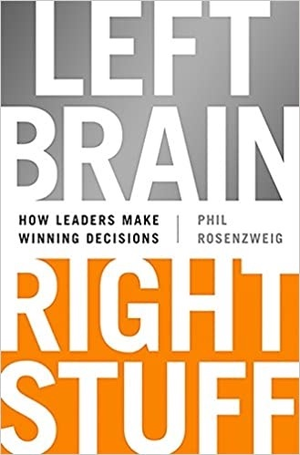

<!--more-->

Este são minhas anotações retiradas do livro de [Phil Rosenzweig](https://www.goodreads.com/author/show/447403.Philip_M_Rosenzweig): ["Left Right, Right Stuff - How Leaders Make Winning Decision"](https://www.goodreads.com/book/show/19990883-left-brain-right-stuff) sobre tomada de decisões de negócio.

## Takeways

* Decisões estratégicas de negócio não podem ser praticadas, elas são únicas e são infrequentes. Diferente de outras situações em que se pode praticar (treinamento) constantemente e ajustar, aprender com o resultado, colher feedback, há decisões em que isso não é possível, não há link direto entre ação e feedback da mesma.

* Tipos de erros em decisão:
** Type I error: 
** Type II error: 

To make the right decisions and avoid biases we need to ask these questions:

* Are we making a decision about something we cannot control, or are we able to influence outcomes?

Many decisions are not choices in single moment in time. In often we underestimate the control we truly have in the outcome. 

* Are we seeking an absolute level of Performance, or is performance relative?

Do we need be better than others? And in this case, we can estimate the skew in the payoffs? Winner take all situation enforce a risker approach. This competition has a clear end point or is open ended? We need play safe to survive and try again?

* Are we making a decision that lends itself to rapid feedback, so we can make adjustments and improve a next effort?
* Are we making a decision as an individual or as a leader in a social setting?
* Are we clear what we mean by overconfidence?
* Have we given careful thought to base rates, whether of the larger population at a point in time or historical rates of past events?
* As for decision models, are we aware of their limits as well as strengths?
* When the best course of action remains uncertain, do we have a sense of on which side we should err?
